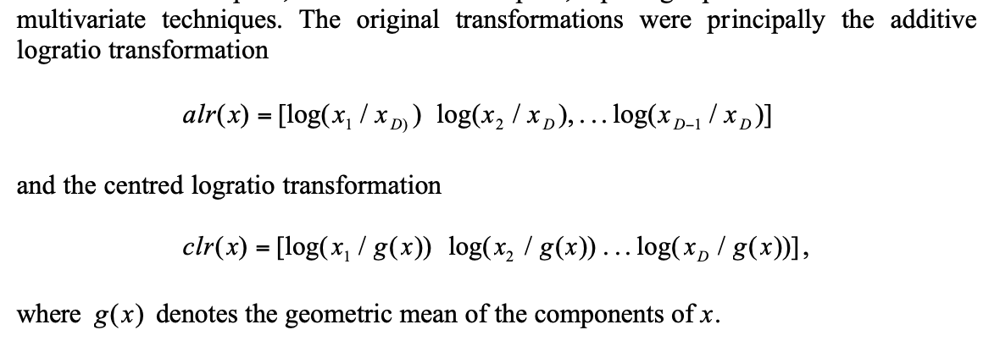

# Notes on the [Pfizer Tx Paper](pfizer-tx.pdf)

Really important paper.

## TL;DR

* Use TPMs and CLR transforms
* Multiple genes are better than one
* Gene sets do not provide an advantage relative to the full gene data
* RF was the best performing method for thirteen tasks, LR for nine tasks, and kNN for two tasks, but LR was more consistent than RF and had better average performance. They didn't try `xgboost` or a NN.
* They implemented L2 LR as the output layer in an NN using Torch. Nice. :)
* PCA and AEs all harmed performance on new data

## Detailed notes
They used the recount2 database - this has been uniformly re-processed.

Code from the paper (at least for nested cv) is [here](https://github.com/unlearnai/representation_learning_for_transcriptomics)

Great post on nested CV is [here](https://weina.me/nested-cross-validation/)

The processed data are now available on [Figshare](https://figshare.com/projects/Deep_learning_of_representations_for_transcriptomics-based_phenotype_prediction/60938)

Centered log-ratio transform for [compositional data](https://en.wikipedia.org/wiki/Compositional_data)

From <http://ima.udg.edu/Activitats/CoDaWork03/Girona_invited_lecture_Aitchsion.pdf>

README for the data is here: <https://ndownloader.figshare.com/files/14548094>

Data for supervised tasks, CLR normalized as recommended: 
<https://ndownloader.figshare.com/files/14546420>